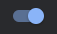

# extension-template
Quickly start building a browser extension with React, TypeScript and webpack HMR!

# Overview
Easy template for getting started building extensions configured for React, TypeScript, and webpack hot reloading.

Currently tested and working with Chrome 

Note: HMR does not work for Content / Background scripts, you must restart browser to trigger Content / Background script updates

## Quick Install Guide:

1. Fork & clone this repo
`git clone https://github.com/[your-git-handle]/extension-template.git`

2. Install node modules
`npm i`

3. Start dev server & build dev bundle
`npm run dev`

## Install your extension in Chrome:

1. In Chrome, navigate to the URL `chrome://extensions/`

2. Enable `Developer mode` on the top-right of page

3. Click `Load unpacked` and navigate to the `/dev` bundle that was created, upload that folder

4. Enable your extension with the toggle button 

5. (Optional) pin your extension for easily toggling the popup.html (main interface)

## Developer notes:

To trigger HMR for your .tsx components, you need to toggle your extension's popup window after you save your changes. 

## Known issues:
- HMR currently not functional with Background and Content scripts, looking into how to implement.